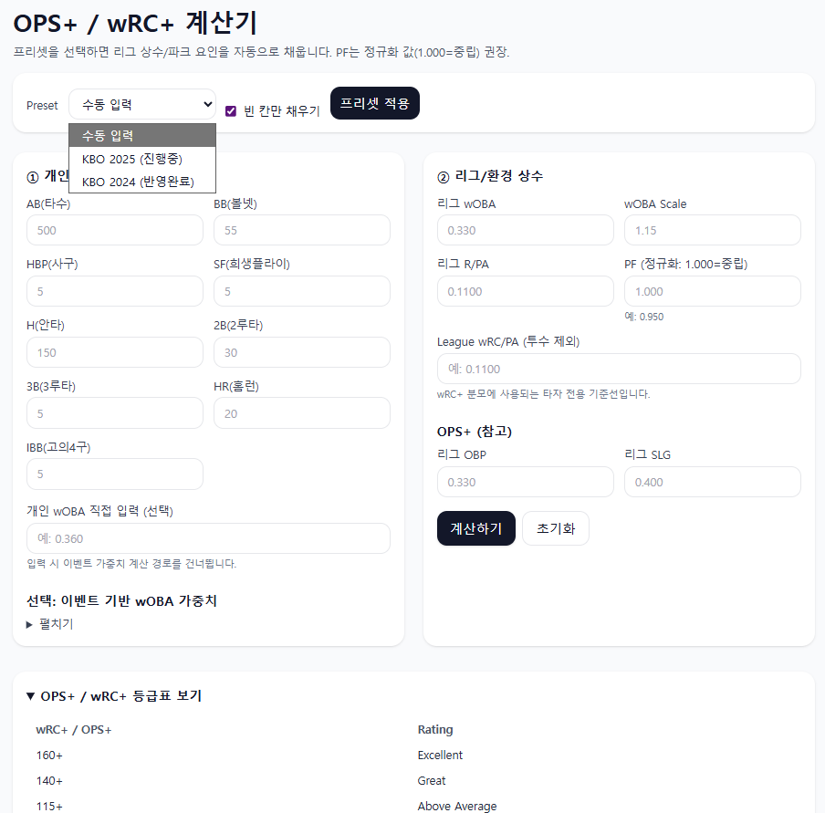
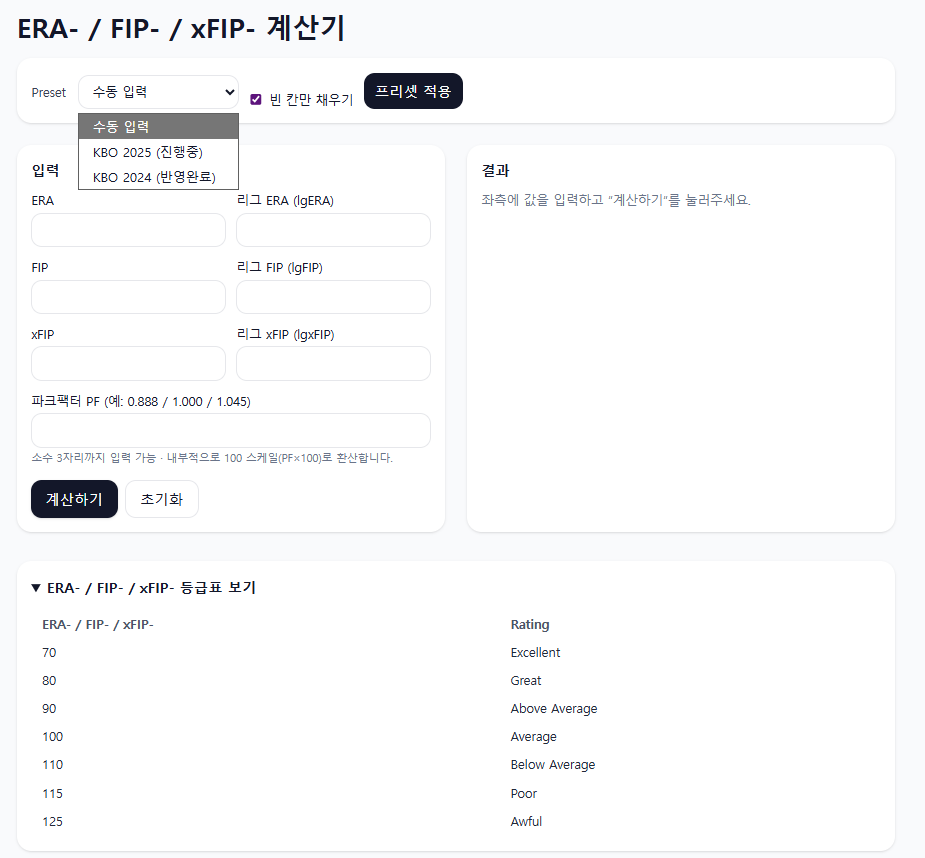
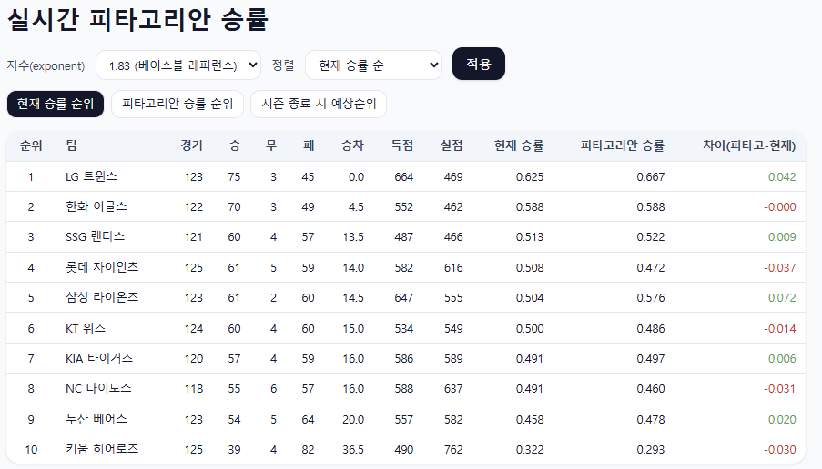

---

# 📄 `docs/en/index.md`
```markdown
<!-- docs/en/index.md -->
# ⚾ KBO Saber App — Overview (EN)

A Flask web app to calculate/visualize **sabermetrics** based on KBO League data.  
Deployed on Render; supports live data via Google Sheets (CSV).

[한국어](../ko/index.md) | [Home](../index.md) | [GitHub](../../README_en.md)

---

## 🚀 Features
- **Hitter Calculator**: OPS, OPS+, wRC, wRC+ (league constants/park factor, presets)
- **Pitcher Calculator**: ERA-, FIP-, xFIP- (presets & park factor)
- **Game Score**: Bill James Game Score & v2.0
- **Real-time Pythagorean**: Google Sheets CSV (cached), actual vs pythag %, Games Behind, projected standings

---

## 🖼️ Screenshots
- Hitter  
  

- Pitcher  
  

- Game Score  
  

- Pythagorean  
  

---

## ⚙️ Local Run
```bash
python -m venv .venv
.\.venv\Scripts\activate   # Windows
pip install -r requirements.txt
python run.py
# http://127.0.0.1:5000
