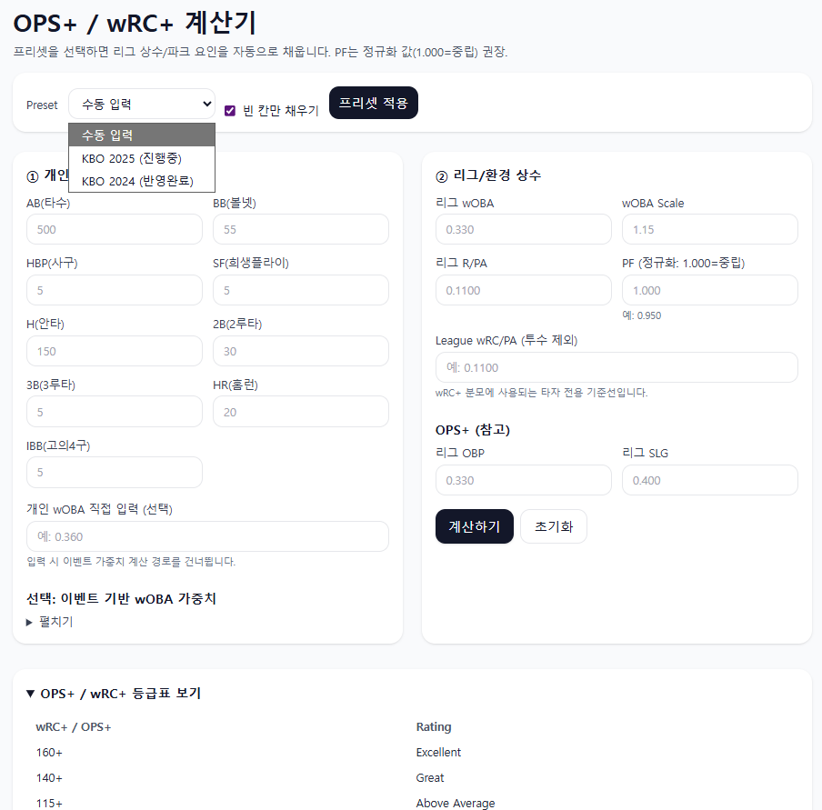
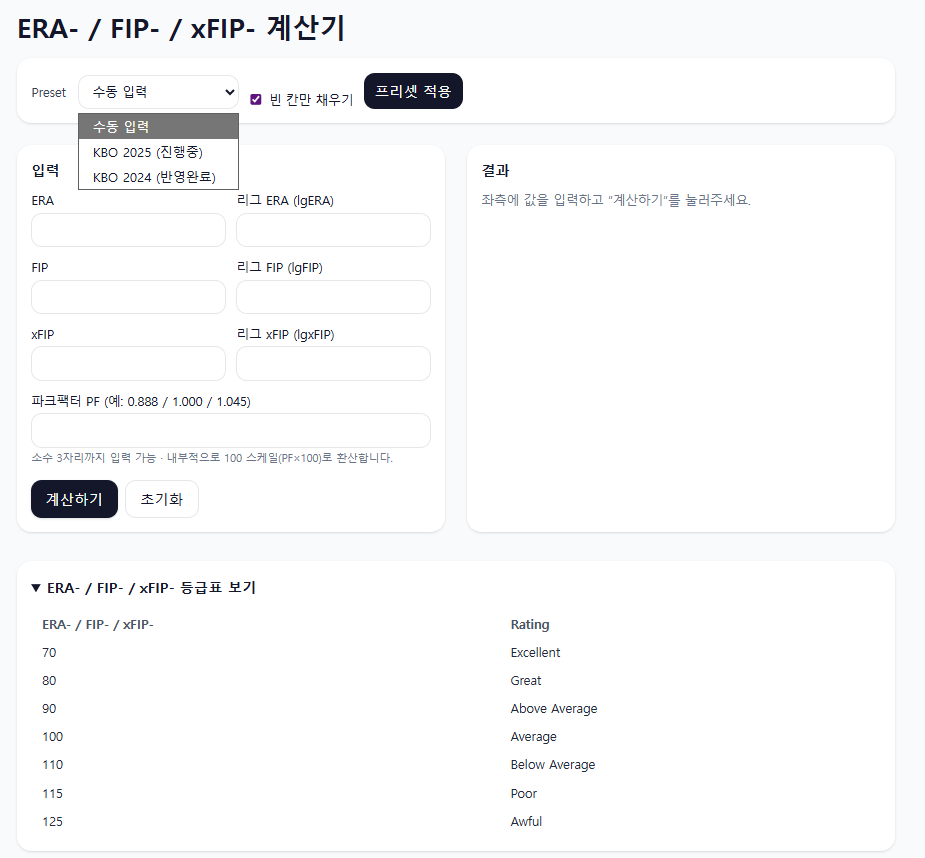
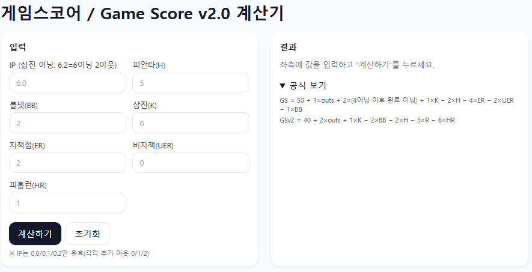

<!-- docs/ko/index.md -->
# ⚾ KBO Saber App — 소개 (KO)

KBO 리그 데이터를 기반으로 다양한 **세이버메트릭스** 지표를 계산/시각화하는 Flask 웹 앱입니다.  
Render로 배포할 수 있으며, Google Sheets(CSV)로 실시간 데이터를 받아옵니다.

[English](../en/index.md) | [홈으로](../index.md) | [GitHub](../../README.md)

---

## 🚀 주요 기능
- **타자 계산기**: OPS, OPS+, wRC, wRC+ (리그 상수/파크팩터, 프리셋 지원)
- **투수 계산기**: ERA-, FIP-, xFIP- (리그 프리셋/파크팩터)
- **게임스코어 계산기**: Game Score, Game Score v2.0
- **실시간 피타고리안 승률**: 구글 시트 CSV 연동(캐시), 현재/피타고 승률 비교, 승차, 시즌 종료 예상 순위

---

## 🖼️ 스크린샷
> 저장소의 `docs/screenshots/`에 이미지를 넣으면 아래 링크가 자동 반영됩니다.

- 타자 계산기  
  

- 투수 계산기  
  

- 게임스코어  
  

- 피타고리안 승률  
  

---

## ⚙️ 로컬 실행
```bash
python -m venv .venv
.\.venv\Scripts\activate   # Windows
pip install -r requirements.txt
python run.py
# http://127.0.0.1:5000
